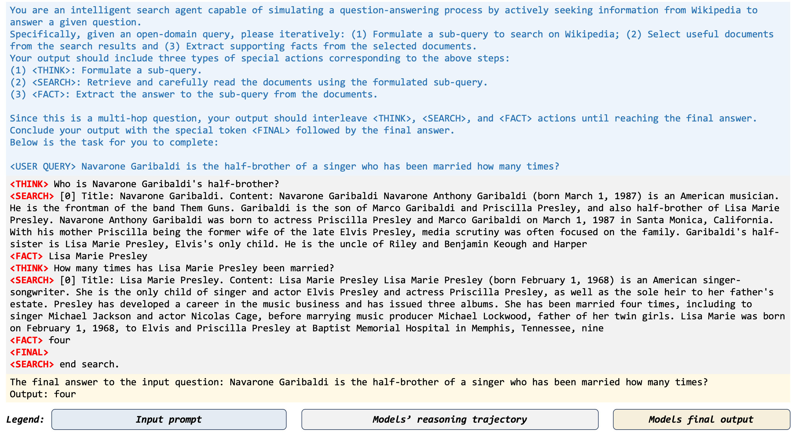

<div align="center">
   <h1>Agentic Search</h1>
</div>

This work proposes the `agentic search` which enable the LLMs as search agents, which can actively seek information, select key knowledge and record useful evidence iteratively and summarize the final answer. Compared with previous RAG methods, the key of our agentic search is the reasoning technique. Here is a concrete example of our agentic search.



## Environment

1. create the `python` env with `conda`

```txt
conda create -n rag python=3.10
conda activate rag
pip install -r requirements.txt
pip install pytrec_eval -i https://pypi.tuna.tsinghua.edu.cn/simple
```

2. [Optional] set the `vllm` environment variable when using it.

```txt
VLLM_WORKER_MULTIPROC_METHOD=spawn
```

3. [Optional] Please login the `wandb` if use it to record the loss.

```txt
wandb login
```

(`wandb login --relogin` to force relogin)


# Dataset

## Download raw dataset


| Dataset             | Note                                                         |                             Link                             |
| :------------------ | :----------------------------------------------------------- | :----------------------------------------------------------: |
| Nature Question     | [Natural Questions: A Benchmark for Question Answering Research](https://aclanthology.org/Q19-1026/) | [Github](https://drive.google.com/file/d/1G3MpQ5a4KgUS13JJZFE9aQvCbQfgSQzj/view?usp=share_link) |
| HotpotQA            | [HotpotQA: A Dataset for Diverse, Explainable Multi-hop Question Answering](https://arxiv.org/abs/1809.09600) |           [Homepage](https://hotpotqa.github.io/)            |
| MuSiQue             | [MuSiQue: Multihop Questions via Single-hop Question Composition](https://arxiv.org/abs/2108.00573) |      [Github](https://github.com/StonyBrookNLP/musique)      |
| 2WikiMultihopQA     | [Constructing A Multi-hop QA Dataset for Comprehensive Evaluation of Reasoning Steps](https://aclanthology.org/2020.coling-main.580.pdf) |     [Github](https://github.com/Alab-NII/2wikimultihop)      |
| Wizard of Wikipedia | [Wizard of Wikipedia: Knowledge-Powered Conversational agents](https://arxiv.org/abs/1811.01241) | [Google drive](https://drive.google.com/file/d/1z327WOKr70rC4UfOlQVBQnuLxChi_uPs/view?usp=share_link) |


## Retrieval Corpus

We follow previous work and use the [Wikipedia 2018](https://dl.fbaipublicfiles.com/dpr/wikipedia_split/psgs_w100.tsv.gz)) as our document corpus, which can be found in [DPR](https://github.com/facebookresearch/DPR/blob/main/dpr/data/download_data.py) repo.
In our official experiment, we use the [ColBERT](https://github.com/stanford-futuredata/ColBERT/tree/main) as the retrieval model to pair each query with top-20 documents. The pre-trained ColBERT checkpoint can be downloaded in either its official repo or its [link](https://downloads.cs.stanford.edu/nlp/data/colbert/colbertv2/colbertv2.0.tar.gz).
You can deploy the *ColBERT retrieval* or *other customized retrieval model* in your experimental environment to implement this document retrieval process. 

# Our method

We first automatically annotate an agentic search dataset to train the base LLM, enabling its initial expertise in RAG tasks. This is similar to the warmup learning of Deepseek-R1, which train a model with supervised fine-tuning dataset before using reinforcement learning method for training.
Below, we show the command for launching the training experiment.

## Warmup training
```shell
MODEL_PATH="<YOUR_MODEL_PATH>"
$WARMUP_DATA_PATH="<YOUR_WARMUP_DATA_PATH>"
$OUTPUT_DIR="<YOUR_OUTPUT_DIR>"

PROCEDURE=sft CUDA_VISIBLE_DEVICES=0,1,2,3,4,5,6,7 nohup torchrun   --nproc_per_node=8 --master_port=11021 ./src/run.py \
--model_name_or_path $MODEL_PATH \
--dataset_name_or_path $WARMUP_DATA_PATH \
--deepspeed ./src/script/ds_z3_config.json \
--output_dir $$OUTPUT_DIR \
--overwrite_cache True \
--warmup_ratio 0.1 \
--report_to wandb \
--run_name test_run \
--logging_steps 1 \
--cutoff_len 8192 \
--max_samples 200000 \
--save_steps  110 \
--per_device_train_batch_size  2 \
--gradient_accumulation_steps 16 \
--learning_rate 2.0e-6 \
--num_train_epochs 2 \
--lr_scheduler_type cosine \
--bf16 True &
```

## Alignment 

After the warmup learning, the LLM is initialized the basic expertise in agentic search. Thus, we alternate the following steps to achieve the self-training of agentic search.

### Inference 
We first simulate the task-solving trajectories, e,g., inference, to create the training dataset.

```shell
MODEL_PATH="<YOUR_MODEL_PATH>"
INPUT_FILE="<YOUR_INFERENCE_FILE>"
OUTPUT_DIR="<YOUR_OUTPUT_DIR>"

PROCEDURE=inference CUDA_VISIBLE_DEVICES=1,2,3,4,5,6,7 python ./src/run.py \
--model_name_or_path  $MODEL_PATH \
--input_file $$INPUT_FILE \
--output_dir $OUTPUT_DIR \
--left 0 \
--right 100000 \
--shuffle True
```

### Entropy 

Then, we compute the entropy to compute the log-probability in generating the final answer. This log-probability takes the roles as a weight on the final learning loss function.
```shell
MODEL_PATH="<YOUR_MODEL_PATH>"
INFERENCE_FILE="<YOUR_INFERENCE_FILE>"
OUTPUT_DIR="<YOUR_OUTPUT_DIR>"

PROCEDURE=entropy CUDA_VISIBLE_DEVICES=0,1,2,3,4,5,6,7  python ./src/run.py \
--model_name_or_path  $MODEL_PATH \
--inference_file  $INFERENCE_FILE\
--output_dir $OUTPUT_DIR \
--left 0 \
--right 1000000 \
--epo 2
```

### Format 
Using the task-solving trajectories and the corresponding entropy, we then synthesize the training dataset for the next step.
```shell
INFERENCE_FILE="<YOUR_INFERENCE_FILE>"
ENTROPY_FILE="<YOUR_ENTROPY_FILE>"
OUTPUT_DIR="<YOUR_OUTPUT_DIR>"

PROCEDURE=formate CUDA_VISIBLE_DEVICES=0,1,2,3,4,5,6,7   python ./src/run.py \
--output_dir $OUTPUT_DIR  \
--inference_file  $INFERENCE_FILE \
--entropy_file $ENTROPY_FILE \
--size 200000 \
--epo 2 
```

### Learning

```shell
MODEL_PATH="<YOUR_MODEL_PATH>"
WARMUP_DATA_PATH="<YOUR_WARMUP_DATA_PATH>"
OUTPUT_DIR="<YOUR_OUTPUT_DIR>"

PROCEDURE=sft CUDA_VISIBLE_DEVICES=0,1,2,3,4,5,6,7 nohup torchrun   --nproc_per_node=8 --master_port=11021 ./src/run.py \
--model_name_or_path $MODEL_PATH \
--dataset_name_or_path $WARMUP_DATA_PATH \
--deepspeed ./src/script/ds_z3_config.json \
--output_dir $$OUTPUT_DIR \
--overwrite_cache True \
--warmup_ratio 0.1 \
--report_to wandb \
--run_name test_run \
--logging_steps 1 \
--cutoff_len 8192 \
--max_samples 200000 \
--save_steps  110 \
--per_device_train_batch_size  2 \
--gradient_accumulation_steps 16 \
--learning_rate 2.0e-6 \
--num_train_epochs 2 \
--lr_scheduler_type cosine \
--bf16 True &
```


## Evaluation on Benchmarks

We evaluate our method using the `F1`, `EM` and `Accuracy` metrics. We use the evaluation scripts from official [KILT](https://github.com/facebookresearch/KILT/blob/main/kilt/eval_downstream.py).


## Pre-processed Data

### Download pre-processed evaluation data

You can directly download our pre-processed datasets, which will be provided after the anonymous period.

| File                  | Note                                                  |                             Link                             |
| :-------------------- | :---------------------------------------------------- | :----------------------------------------------------------: |
| nq_dev.json           | Pre-processed data of the NQ dataset                  | [Google drive](https://drive.google.com/file/d/1hp6SjahfoLLmnjNnahyVFkxPDlnmErTO/view?usp=sharing) |
| hotpotqa_dev.json     | Pre-processed data of the HotpotQA dataset            | [Google drive](https://drive.google.com/file/d/1DaWl5SV0KvIUHEIk5MO4tSn7jeWDsLTI/view?usp=sharing) |
| musiqueqa_dev.json    | Pre-processed data of the MuSiQue  dataset            | [Google drive](https://drive.google.com/file/d/1zPXhLAOe1ktDqJDmxNoRLMQ2ml-Jup-6/view?usp=sharing) |
| wikimultihop_dev.json | Pre-processed data of the 2WikimultihopQA dataset     | [Google drive](https://drive.google.com/file/d/1HAjSFswVDmmfJIAXo4qMLjtAUB8YWjD1/view?usp=sharing) |
| wow_dev.json          | Pre-processed data of the Wizard-of-Wikipedia dataset | [Google drive](https://drive.google.com/file/d/1B2qSjEzR5w_AG1nZQVEKzeLbCvOCQPLd/view?usp=sharing) |

### Download pre-processed training data

| File                    | Note                                             |                             Link                             |
| :---------------------- | :----------------------------------------------- | :----------------------------------------------------------: |
| nq_train.json           | Training data of the NQ dataset                  | [Google drive](https://drive.google.com/file/d/1hw_h2gsroJZiWKRiBb2aIaXGjy1Wvgdw/view?usp=sharing) |
| hotpotqa_train.json     | Training data of the HotpotQA dataset            | [Google drive](https://drive.google.com/file/d/1GxE-1psv-ksoY313Dq1qgYA98vw7t2JQ/view?usp=sharing) |
| musiqueqa_train.json    | Training data of the MuSiQue  dataset            | [Google drive](https://drive.google.com/file/d/1REtwkyPwLVL7NVXPvHJ9ezYletsmhSwK/view?usp=sharing) |
| wikimultihop_train.json | Training data of the 2WikimultihopQA dataset     | [Google drive](https://drive.google.com/file/d/1D6PRMwaj-7ilXajz70OP54h8KNWwOV8l/view?usp=sharing) |
| wow_train.json          | Training data of the Wizard-of-Wikipedia dataset | [Google drive](https://drive.google.com/file/d/1bv6BK_eWRch60gP5rJ-Q_gPbUQI_EOxZ/view?usp=sharing) |

### Download the warmup learning dataset

The warmup learning dataset will be released in [Huggingface dataset]() as soon as possible.

### Download the model checkpoint

We first release two trained search agents with different parameter size, including `Search-agent-Mistral-24B` andd `Search-agent-Llama-3.1-8B`. Please see our [Huggingface Collection](https://huggingface.co/collections/mangopy/latent-search-simulator-679f5f84575df6520dc60b3d) for more details. You can download their weight and conduct inference using our `inference` code.

## Todo
- [ ] Our paper will be released as soon as possible
- [ ] We will release the inference trajectories for each trained checkpoint.
- [ ] We will release the warmup learning datasets and our data synthetic code.
- [ ] Checkpoints will be released.

## Acknowledgement

We sincerely thank prior work, including [RankGPT](https://github.com/sunnweiwei/RankGPT) and [Llama-Factory](https://github.com/hiyouga/LLaMA-Factory/tree/main).
